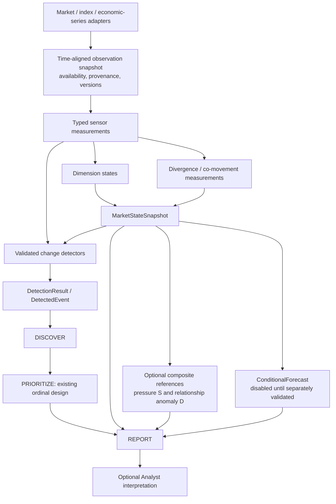

# Sentinel multi-sensor architecture — design revision after 6B-2F

Status: **AGREED DESIGN DIRECTION; STATE RUNTIME FIXTURE-VALIDATED**. Task **6B-2G**
has now frozen the first sensor/availability and output contracts, reference
research baselines and validation protocol in the
[versioned contract specification](sentinel-sensor-contracts-v1.md). This
architecture remains the broader direction; the protocol governs the first
subset. [6B-2H](sentinel-market-state-runtime.md) implements the state/measurement
subset with fixture conformance; live-source coverage and empirical utility
remain unpassed gates.

## Purpose and scope

Sentinel observes current market conditions, detects meaningful changes, and,
only after separate validation, supplies conditional forecasts. These are three
different claims with different evaluation targets. A slow trend state must not
be treated as a timely change detector or a forecast without evidence.

Initial scope is US equities, with volatility, credit, rates, and funding
context. SPY measures a capitalization-weighted large-cap basket; it is one
sensor, not a representation of the entire market. Market state must expose
internal participation and leadership divergence. It must remain useful when
some inputs or the optional Analyst layer are unavailable.

The existing pipeline remains **SEE → DETECT → DISCOVER → PRIORITIZE → REPORT**.
The following diagram expands SEE and DETECT; it does not introduce a parallel
priority engine or replace the implemented observation/event foundations.

Sensor measurement, dimension state and state-report projection are implemented
in 6B-2H; new detectors, references and forecasts remain gated design/research. OHLCV continues through `MarketContext`;
non-OHLCV series require explicit adapter/domain contracts, not fabricated bars.

## Sensor dimensions and measurement boundaries

| Dimension | Candidate evidence | Interpretation boundary |
| --- | --- | --- |
| Trend and leadership | SPY, equal-weight proxy, large-cap leadership groups, sector relative strength | Index direction and leadership can disagree. |
| Participation and concentration | Constituent breadth, weight/contribution concentration; SPY/RSP as a labelled proxy | RSP is not the S&P 500 excluding Mega 7; IWM is not that remainder either. |
| Volatility | SPX option-implied VIX, realized volatility, optionally term structure | VIX is approximately 30-day annualized implied volatility, not market direction or realized volatility. |
| Credit and funding | Credit spreads and approved funding series | Different update frequencies and publication delays must be explicit. |
| Rates and cross-asset context | Yield series and relevant equity/rate relationships | Context does not automatically imply an equity stress event. |

These are candidate families, not an approved provider list. Membership,
weights, and historical constituents must be point-in-time for true constituent
breadth and contribution calculations. If that history is unavailable, label a
proxy or disable the feature; never reconstruct past breadth using today's
members. Mega-7 membership also needs a dated definition before use.
Concentration is structural vulnerability, not automatically present stress.
A narrow rally may persist; divergence is evidence to report, not a bearish
prediction by definition.

Each sensor contract must specify subject, units, meaning, dimension,
redundancy group, method/version, lookback, observation time, actual availability
time, source/version, quality, and authoritative-versus-proxy status. Publication
lags, revisions, stale inputs, corporate actions, and provider error behavior
belong to the availability contract. At decision time t, only evidence actually
available by t is admissible. Historical replay cannot silently use later
revisions. Coverage and statistical reliability are separate fields.

## Four distinct output responsibilities

| Design output | Responsibility | Required boundary |
| --- | --- | --- |
| `MarketStateSnapshot` | Current dimension vector, relationships, coverage, evidence and as-of times | No invented global RISK_ON/RISK_OFF regime without its own approved model. |
| `DetectionResult` / `DetectedEvent` | Material observed changes with explicit evaluation status | Reuse the nine primitives; no trade recommendations. |
| `CompositeReference` | Optional pressure S, relationship anomaly D, deltas and contributions | Reference values, not priority scores or calibrated probabilities. |
| `ConditionalForecast` | Explicit future target, horizon, conditional estimate and validation version | Disabled unless separate predictive validation passes. |

`MarketStateSnapshot` is implemented; CompositeReference and ConditionalForecast
remain future runtime contracts. Snapshot
facts, change events, and optional research attachments must remain distinguishable
in reports. The explicit SentinelReport v0.2 design revision in 6B-2G adds optional
snapshot/reference/forecast fields; it does not silently alter v0.1 required fields.
SPY remains a portfolio performance benchmark without becoming the authoritative
market-state proxy. Holdings affect relevance downstream, not global state
measurement.

## Simple references before complex models

First establish dimension states without requiring a single summary number.
The initial research baseline for pressure is:

`S_t = 100 × sum_g(w_g × s_g,t)`

Group scores are bounded and oriented to a defined pressure target; approved
weights sum to one. Aggregation occurs within redundancy groups before across
groups, so several correlated volatility sensors do not become independent
votes. Scaling uses only available past history; any empirical percentile,
window, minimum history, weight, and direction must be pre-registered.

Keep relationship anomaly `D_t` separate: persistent concentration, disagreement,
and unusual co-movement must not disappear inside an average pressure score.
The first D candidate is frozen in 6B-2G as a separate robust-z divergence
reference. Any correlation extension requires a new pre-registration before
adopting covariance inversion or dynamic factors.
A correlation-weighted CISS-style extension is a research comparator only;
retain it only if it adds measurable OOS value over the simple baseline.

Missing required inputs make the defined reference unavailable, not zero.
Do not silently redistribute weights under the same index name. An optional
partial reference needs an explicit version, coverage and comparability policy.
Local detectors may emit valid events independently of S or D; a low average
must not suppress a material local change. Neither reference replaces ordinal
Priority, creates a P0 hard gate, or changes the frozen top-K/P0 rules.

## Validation gates and task numbering

| Task | Deliverable and gate |
| --- | --- |
| **6B-2G — Multi-Sensor Contracts & Validation Protocol** | Freeze scope, sensors, timing, outputs, labels/targets, baselines, splits, acceptance criteria, and report-contract revision. No new detector selection yet. |
| **6B-2H — Multi-Dimensional Market State Snapshot** | Validate faithful current-state measurement, independence/redundancy, coverage, stale/missing behavior and causal replay. |
| **6B-2I — Composite Reference & Relationship Research** | Freeze simple S/D candidates; compare dimension-only baselines; require incremental OOS utility and sensitivity checks before additional complexity. |
| **6B-2J — Online Change Detection Validation** | Sequential evaluation using only available past evidence; measure false alarms, missed changes, detection delay, persistence and abstention coverage. Promote only passing detectors. |
| **6B-2K — Conditional Forecast Research** | Separate future targets/horizons; predictive baselines, calibration, sample support and incremental OOS utility; remain disabled on failure or insufficient evidence. |

Pre-register change targets independently of candidate detector outputs. Any
future-defined research outcome is evaluation-only and cannot enter online
features. Split and embargo/purge overlapping outcome windows as appropriate;
freeze rules before results. Threshold selection belongs to training/selection,
not OOS. This already-observed 2005–2026 dataset is research evidence, not a new
untouched holdout for unrestricted redesign. Use explicit reuse disclosure and
a genuinely held-out or prospective evaluation for new confirmation.

The parent **6B-2 — Trend Change + Volatility Change** remains open. Participation
and relationship research supports it; remaining production integration stays
under 6B-3 rather than duplicating the research. Discovery, Priority, Report and
Analyst retain their 6C–6F numbering. This is not Task 7.

## Existing behavior and archived research

6B-1 Activity Anomaly remains the implemented minimal daily detector.
[EWMAC research](../../research/sentinel/6b-2e-6b-2f-ewmac/README.md) is archived:
Stage-A WEAK_PASS followed by robustness FAIL. It is a reproducible baseline,
not a production component. 6B-2G validates the frozen protocol artifact, and
6B-2H implements fixture-validated state measurement, not new detectors.
Sentinel stays read-only; execution and the separate trading-agent path are outside this
preparation. LLM interpretation remains downstream of
deterministic facts and cannot change measurements, events, or hard gates.

## Literature informing the design

These sources motivate candidate designs; none validates DX27's proposed score
or proves useful daily equity change detection.

- Holló, Kremer and Lo Duca (2012), [CISS, ECB Working Paper 1426](https://www.ecb.europa.eu/pub/pdf/scpwps/ecbwp1426.pdf): grouped stress inputs and correlation-aware aggregation. The composite is a stress measure, not a future probability.
- Carlson, Lewis and Nelson (2012), [Using Policy Intervention to Identify Financial Stress](https://www.federalreserve.gov/pubs/feds/2012/201202/index.html): level, variability and co-movement; stress classification is distinct from early warning.
- Kritzman and Li (2010), [Skulls, Financial Turbulence, and Risk Management](https://rpc.cfainstitute.org/research/financial-analysts-journal/2010/skulls-financial-turbulence-and-risk-management), and Kinlaw and Turkington, [Correlation Surprise](https://link.springer.com/article/10.1057/jam.2013.27): covariance-relative unusualness and unusual relationships; not simply high correlation.
- Kritzman, Li, Page and Rigobon (2011), [Principal Components as a Measure of Systemic Risk](https://papers.ssrn.com/sol3/papers.cfm?abstract_id=1633027): absorption ratio concerns common variance, not market-cap concentration.
- Zaremba et al. (2021), [Herding for Profits](https://www.sciencedirect.com/science/article/pii/S0264999319312982): breadth evidence at monthly/cross-country scope; not direct validation of Sentinel daily alarms. Prior review used the abstract, not a full-text audit.
- Monin (2017), [The OFR Financial Stress Index](https://www.financialresearch.gov/working-papers/files/OFRwp-17-04_The-OFR-Financial-Stress-Index.pdf): categorized multi-market stress measurement; current stress differs from latent vulnerability.
- OECD/JRC (2008), [Handbook on Constructing Composite Indicators](https://www.oecd.org/en/publications/handbook-on-constructing-composite-indicators-methodology-and-user-guide_9789264043466-en.html): explicit normalization, weighting and sensitivity analysis.
