# DX27 System Overview

DX27 is a modular trading decision system.

Its purpose is to separate trading knowledge, portfolio decision logic,
capital allocation, risk control, and execution infrastructure.

The same strategy logic should be usable across:

- historical backtesting
- paper trading
- live trading
- advisory analysis

Infrastructure such as LEAN, market-data providers, and broker APIs must remain
outside the DX27 domain logic and connect through adapters.


# 1. System Context

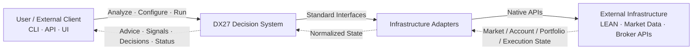

DX27 itself must not depend directly on a specific broker, market-data provider,
or trading engine.

External systems are accessed through adapters.


# 2. High-Level Architecture

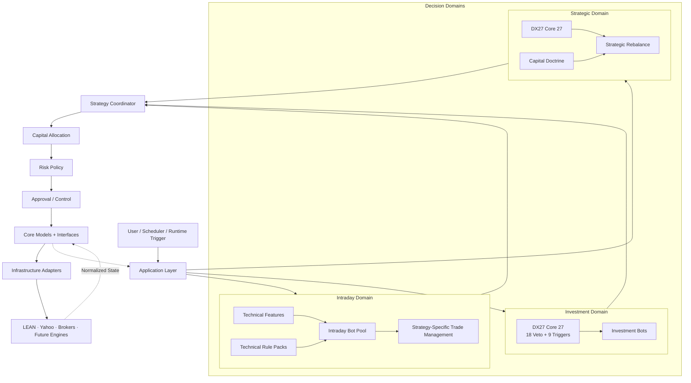

The Application Layer orchestrates workflows.

Runners must not directly coordinate domain logic, account state, strategy
execution, or infrastructure calls.


# 3. Decision Domains

DX27 separates trading decisions into three domains because their information
requirements, time horizons, and decision rules are fundamentally different.


## 3.1 Intraday Domain

The Intraday Domain is designed for fast technical trading.

It does not use the DX27 Core 27 investment framework by default.

Typical inputs include:

- price
- OHLCV
- volume
- volatility
- momentum
- trend
- VWAP
- market structure
- time-of-day information

Typical strategies may include:

- breakout
- momentum
- VWAP reclaim
- mean reversion
- opening-range strategies

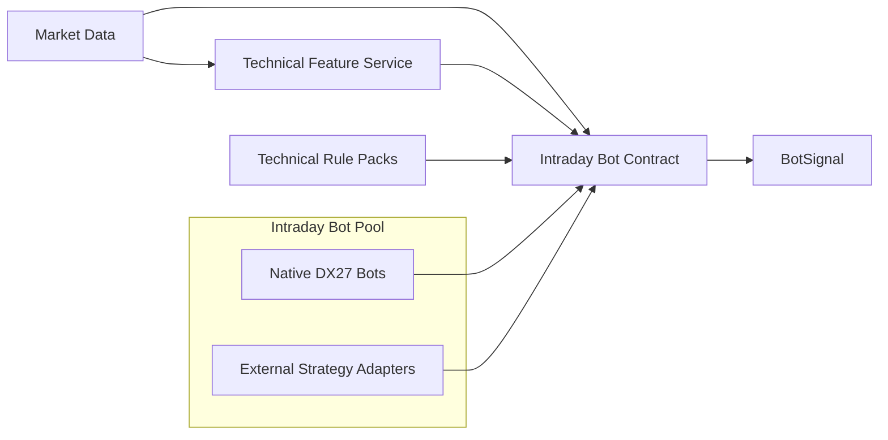

Intraday strategies must remain replaceable.

A strategy should be removable from DX27 and tested independently without
depending on account execution infrastructure.


## 3.2 Investment Domain

The Investment Domain handles medium- and long-term trading analysis.

Its main decision framework is the DX27 Core 27:

- 18 veto / risk rules
- 9 positive entry triggers

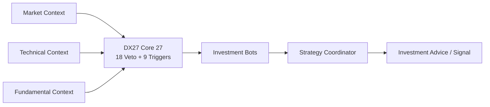

The Core 27 is primarily an investment decision framework.

It is not required for every intraday trade.


## 3.3 Strategic Domain

The Strategic Domain handles major portfolio-level decisions such as:

- annual rebalance
- major capital reallocation
- sector exposure changes
- long-cycle portfolio restructuring

It combines:

- DX27 Core 27
- Capital Doctrine
- portfolio state
- macro context
- sector context

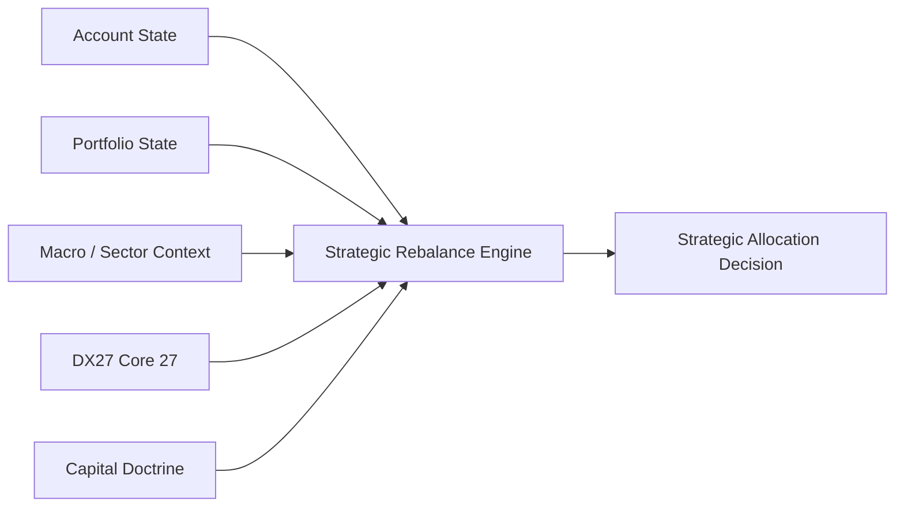

Capital Doctrine is a long-term allocation philosophy.

It is different from runtime capital allocation.


# 4. Application Layer

The Application Layer coordinates complete use cases.

Examples:

```text
Intraday Trading
Investment Analysis
Strategic Rebalance
Historical Backtest
Paper Trading
```

The Application Layer is responsible for orchestration, not trading logic.

Conceptually:

```text
Runner
   ↓
Application
   ↓
Domain
   ↓
Coordinator
   ↓
Capital
   ↓
Risk
   ↓
Execution
```

Possible future structure:

```text
application/
├── intraday.py
├── analyze.py
├── rebalance.py
└── backtest.py
```


# 5. Shared State

Market information alone is not enough.

DX27 must also understand the current account and portfolio state.

The shared state layer contains normalized snapshots of external reality.

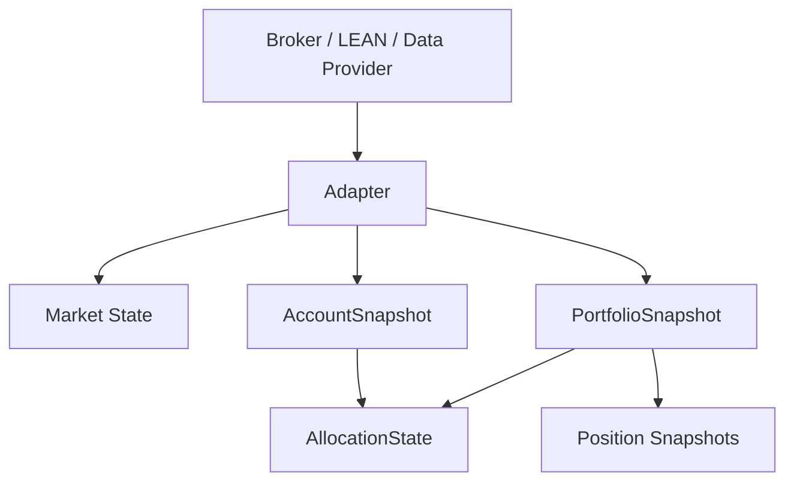

External infrastructure remains the authoritative source of account state.

DX27 maintains normalized representations of that state.


# 6. Account Model

`AccountSnapshot` describes the entire trading account.

Typical information includes:

```text
total equity
cash
buying power
margin state
currency
```

Example:

```text
Total Equity     €10,000
Cash              €4,000
Buying Power      €8,000
```


# 7. Portfolio Model

`PortfolioSnapshot` describes current holdings.

Example:

```text
AMD      €1,500
AMZN     €1,000
SOXL       €500
Cash     €4,000
```

Each position is represented by a normalized `Position` model.

Typical position state includes:

```text
symbol
quantity
average price
market price
market value
```


# 8. Capital Allocation

Capital Allocation determines how much account capital a strategy or domain
is allowed to use.

It does not determine whether a market setup is attractive.

Example:

```text
Total Equity = €10,000

Intraday allocation       15%
Investment allocation     60%
Strategic reserve         25%
```

Therefore:

```text
Intraday Budget       €1,500
Investment Budget     €6,000
Strategic Reserve     €2,500
```

If the intraday domain has already used €900:

```text
Intraday Budget       €1,500
Used                    €900
Available               €600
```

An intraday strategy cannot exceed that remaining budget.

Conceptually:

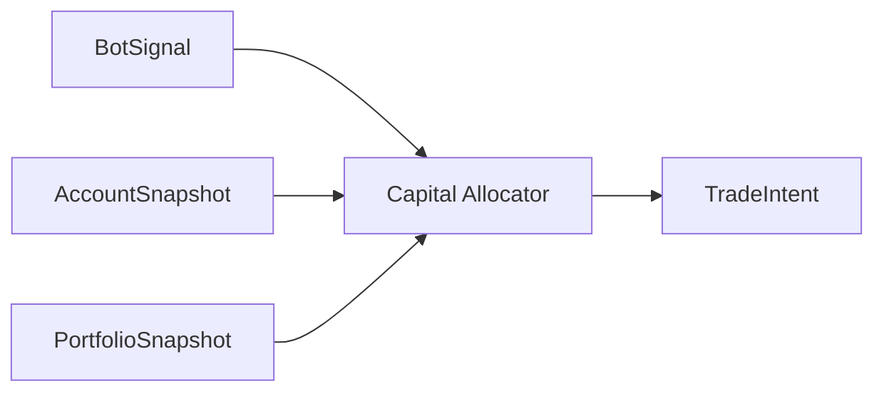

Capital allocation answers:

> How much capital may this strategy use?


# 9. Risk Layer

Risk is separate from capital allocation.

Capital allocation answers:

> How much money is available?

Risk answers:

> Is this trade allowed?

Risk policies may eventually include:

```text
maximum position exposure
daily loss limits
portfolio concentration
correlation limits
existing position conflicts
maximum strategy drawdown
order-size constraints
```

Conceptually:

```text
BotSignal
    ↓
Capital Allocation
    ↓
Candidate TradeIntent
    ↓
Risk Policy
    ↓
Approved / Rejected TradeIntent
```


# 10. Signal and Execution Separation

A market opinion is not an order.

DX27 separates several stages.


## BotSignal

Represents strategy opinion.

Example:

```text
AMD
Direction: LONG
Confidence: 0.82
Reason: momentum breakout
```


## TradeIntent

Represents a proposed trading action after coordination and capital allocation.

Example:

```text
BUY AMD
Notional: €500
Strategy: intraday_momentum_v2
```


## ExecutionReport

Represents what actually happened at the broker or execution engine.

Example:

```text
Requested: 5 shares
Filled:    5 shares
Average Fill: $168.42
Status: Filled
```

Therefore:

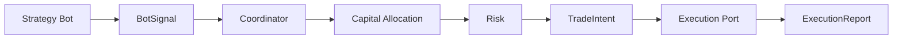


# 11. Runtime Data Flow

The complete runtime loop includes both market data and account state.

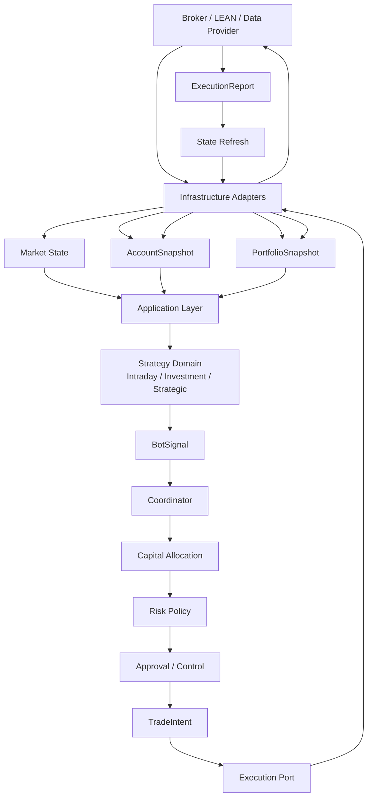

The broker or runtime remains the authoritative source of account state.

DX27 should not manually assume that a submitted order changed cash or
positions.

After execution:

```text
Order
↓
Broker / Engine
↓
Fill
↓
ExecutionReport
↓
Refresh Account + Portfolio
↓
New Snapshot
↓
Application continues with refreshed state
```


# 12. Intraday Bot Contract

An intraday strategy must be isolated from infrastructure.

Native DX27 strategies and externally sourced strategies should eventually
follow the same logical contract.

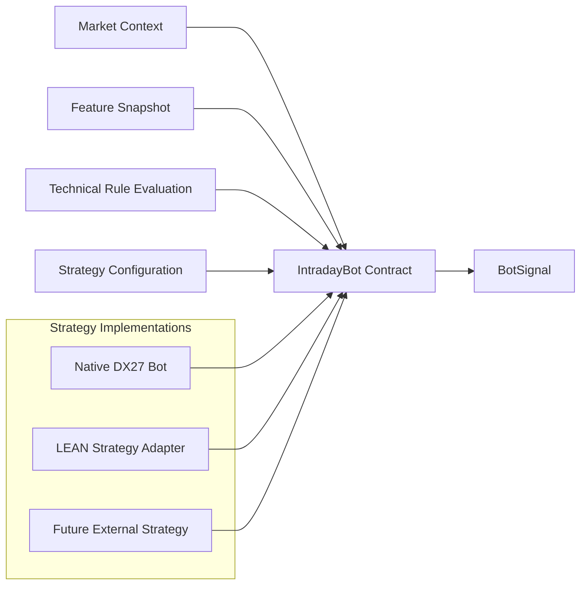

The strategy should not need to know:

```text
which broker is connected
whether execution is backtest/paper/live
how account state is retrieved
how orders are transmitted
```


# 13. Rule Architecture

Rules are reusable decision components.

Bots should not eventually hard-code independent copies of common rules.

The intended architecture is:

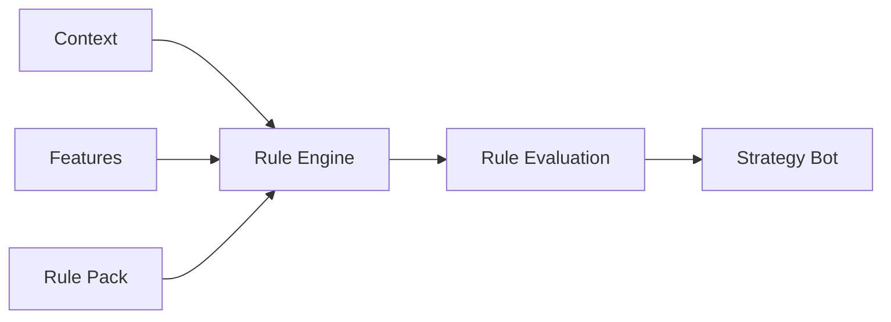

Different domains may use different rule packs.


## Intraday

```text
Technical Rule Packs
```

Examples:

```text
momentum
volume
trend
volatility
VWAP
breakout
```


## Investment

```text
DX27 Core 27
```

Contains:

```text
18 veto / risk rules
9 positive triggers
```


## Strategic

Uses:

```text
DX27 Core 27
+
Capital Doctrine
```


# 14. Strategy Bot Pool

DX27 should support multiple strategy implementations.

```text
Intraday Bot Pool
├── Native DX27 Bots
│   ├── Momentum V1
│   ├── Momentum V2
│   ├── Breakout V1
│   └── VWAP V1
│
└── External Strategy Adapters
    ├── LEAN Momentum
    ├── LEAN EMA Strategy
    └── Future Strategies
```

An external strategy may be used as a baseline.

DX27-specific technical rules can then be added iteratively and compared
against that baseline.


# 15. LEAN Integration

LEAN can play two different roles and these must remain separate.


## 15.1 LEAN as Runtime Infrastructure

DX27 strategy logic remains native.

LEAN provides:

```text
market data
backtesting
portfolio state
paper trading
execution
```

Conceptually:

```text
DX27 Strategy
      ↓
DX27 Contracts
      ↓
LEAN Runtime Adapter
      ↓
LEAN
```


## 15.2 LEAN as Strategy Source

Existing LEAN strategies may also be wrapped as DX27-compatible bots.

```text
LEAN Strategy
      ↓
LEAN Strategy Adapter
      ↓
IntradayBot Contract
      ↓
BotSignal
```

Suggested future structure:

```text
adapters/lean/
├── runtime/
│   ├── market_data.py
│   ├── account.py
│   ├── portfolio.py
│   └── execution.py
│
├── strategies/
│   ├── momentum.py
│   └── ema_cross.py
│
└── bridge/
```


# 16. Adapter Principle

DX27 Core must never import LEAN, Yahoo Finance, broker SDKs, or other external
infrastructure.

Dependencies point inward.

Correct:

```text
LEAN
  ↓
LEAN Adapter
  ↓
DX27 Interfaces
```

Incorrect:

```text
DX27 Core
  ↓
LEAN
```

This allows infrastructure to be replaced without rewriting strategy logic.


# 17. Core Ports

The planned core interfaces are:

```text
core/interfaces/
├── market_data.py
├── account.py
├── portfolio.py
├── execution.py
├── intraday_bot.py
└── strategy.py
```

Responsibilities:


## MarketDataPort

Provides normalized market information.


## AccountPort

Provides normalized account-level state.


## PortfolioPort

Provides current holdings and position state.


## ExecutionPort

Accepts approved trade intents and communicates with external execution
infrastructure.


## IntradayBot

Defines the standard contract for short-term trading bots.


# 18. Core Models

The shared model layer should contain normalized objects such as:

```text
core/models/
├── market_context.py
├── account_snapshot.py
├── portfolio_snapshot.py
├── position.py
├── bot_signal.py
├── trade_intent.py
├── execution_report.py
├── rule_result.py
├── feature_snapshot.py
└── strategy_metadata.py
```

These models form the common language between domains and infrastructure.


# 19. Backtest / Paper / Live Principle

Strategy logic must remain identical across execution environments.

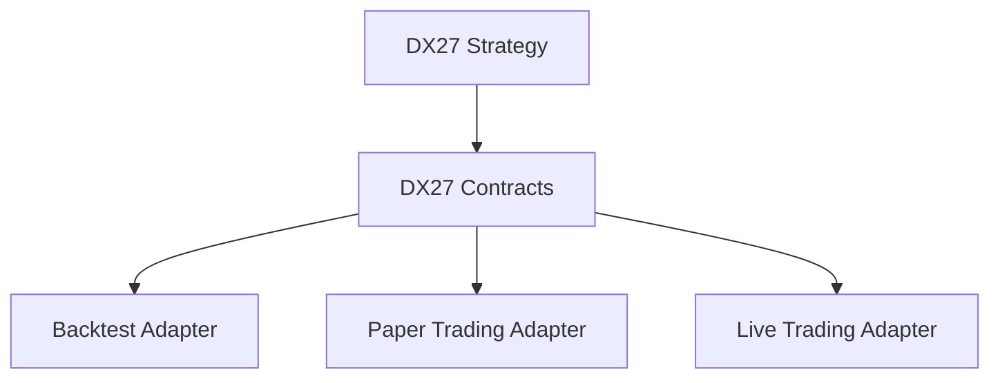

Only adapters change.


## Backtest

```text
Historical Market Data
+
Simulated Account
+
Simulated Portfolio
+
Simulated Execution
```


## Paper Trading

```text
Live Market Data
+
Paper Account
+
Paper Portfolio
+
Paper Execution
```


## Live Trading

```text
Live Market Data
+
Live Account
+
Live Portfolio
+
Live Execution
```


# 20. State Ownership Principle

Strategy bots do not own account state.

Bots may create opinions and strategy-specific state, but account truth belongs
to external infrastructure.

Responsibilities:

```text
Bot
    market interpretation

Coordinator
    combine / route strategy decisions

Capital
    allocate available money

Risk
    enforce trade and account constraints

Execution
    communicate orders

Broker / LEAN
    authoritative execution and account state

Application
    orchestrate the complete flow
```


# 21. Runner Principle

Runners are composition roots.

They assemble the application and select adapters.

They must not contain:

- technical indicators
- strategy rules
- stop-loss logic
- take-profit logic
- portfolio calculations
- account calculations
- PnL calculations
- broker-specific business logic

A runner should eventually be approximately:

```python
app = create_application(
    environment="backtest",
)

app.run()
```

Changing from backtest to paper trading should primarily change configuration
and adapters, not strategy code.


# 22. Target Package Structure

The intended architecture is:

```text
src/dx27/
├── application/
│
├── core/
│   ├── interfaces/
│   └── models/
│
├── domains/
│   ├── intraday/
│   │   ├── bots/
│   │   ├── features/
│   │   ├── rules/
│   │   └── trade_management/
│   │
│   ├── investment/
│   │   ├── bots/
│   │   └── rules/
│   │       └── dx27_core_27/
│   │
│   └── strategic/
│       ├── doctrine/
│       └── rebalance/
│
├── capital/
│
├── coordinator/
│
├── coverage/
│
├── risk/
│
├── approval/
│
└── adapters/
    ├── yahoo/
    └── lean/
        ├── runtime/
        ├── strategies/
        └── bridge/
```


# 23. Architectural Boundaries

The following boundaries are fundamental.


## Domain Independence

Intraday trading does not automatically depend on:

```text
fundamental analysis
DX27 Core 27
Capital Doctrine
```

Investment decisions use:

```text
technical context
fundamental context
DX27 Core 27
```

Strategic decisions use:

```text
portfolio context
macro / sector context
DX27 Core 27
Capital Doctrine
```


## Strategy Independence

A strategy must not depend directly on:

```text
LEAN
Yahoo
broker APIs
paper/live environment
```


## Capital Independence

A strategy may propose a trade.

It does not control how much of the total account it is allowed to use.


## Execution Independence

A TradeIntent does not imply execution success.

Only an ExecutionReport confirms external execution.


## State Authority

Broker / execution infrastructure is the authoritative account-state source.

DX27 operates on normalized snapshots and refreshes them after external state
changes.


# 24. Architectural Goal

DX27 should ultimately allow the following workflow:

```text
                     Same DX27 Strategy
                            │
                            ▼
                      BotSignal
                            │
                            ▼
                       Coordinator
                            │
                            ▼
                    Capital Allocation
                            │
                            ▼
                          Risk
                            │
                            ▼
                       TradeIntent
                            │
             ┌──────────────┼──────────────┐
             ▼              ▼              ▼
         Backtest          Paper           Live
             │              │              │
             └──────────────┼──────────────┘
                            ▼
                     ExecutionReport
                            │
                            ▼
                  Account / Portfolio Refresh
```

This separation allows DX27 to evolve trading logic without repeatedly
rewriting infrastructure, execution, account handling, or testing systems.