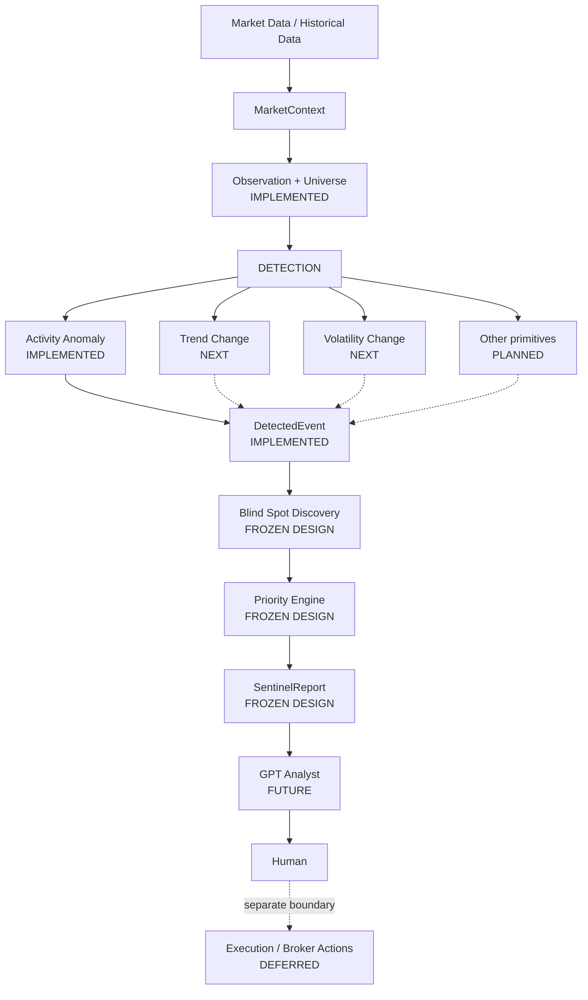
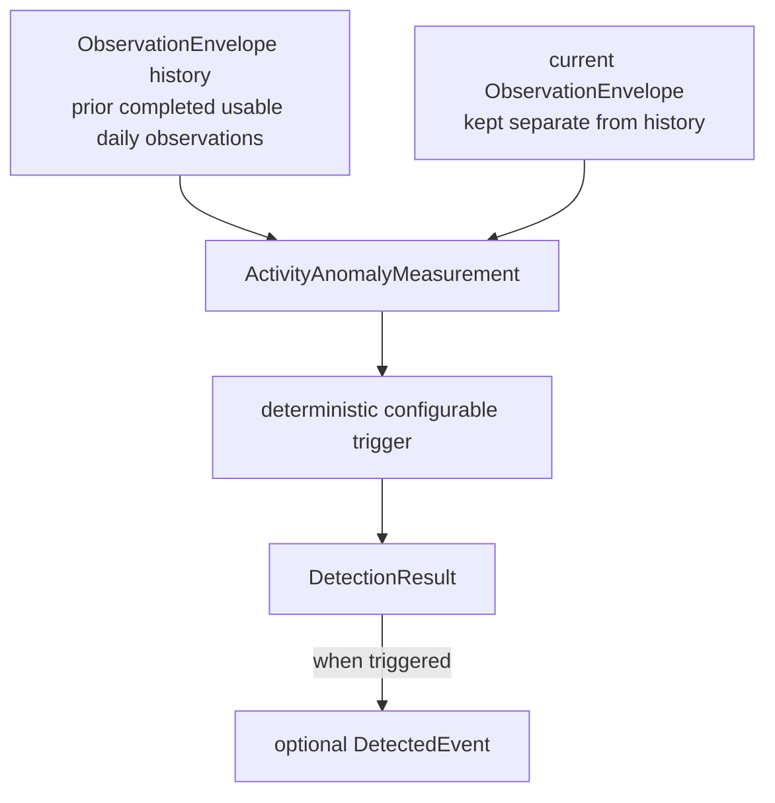

# DX27 System Overview

## 1. What DX27 is now

DX27 is currently being developed **Sentinel-first**: a deterministic, read-only
market observation system that turns completed market data into explicit,
replayable evidence for a human. Sentinel describes material changes; it does
not produce trading signals or control a portfolio.

The status labels in this document are deliberate:

- **IMPLEMENTED** — working contracts or behavior exist in the repository and
  are covered by tests.
- **FROZEN DESIGN** — semantics have been agreed, but the component is not yet
  implemented.
- **NEXT** — the immediate implementation work.
- **DEFERRED** — intentionally outside the current implementation path.

Infrastructure providers remain behind adapters. `MarketContext` is the
existing normalized OHLCV boundary used by Sentinel; provider or broker objects
must not enter Sentinel domain contracts.

## 2. Active architecture



Solid arrows describe the current conceptual direction. Dashed detector arrows
do not imply that the **NEXT** or **PLANNED** detectors already exist. GPT is
downstream of deterministic evidence and never sits inside detection.

## 3. Implemented foundation

### 3.1 Common foundation — 6A-1 (**IMPLEMENTED**)

The common layer supplies `DataStatus`, `SubjectRef`, `ObservationWindow`, and
`Provenance`, together with deterministic canonical serialization, hashing, and
stable identity utilities. Its purpose is stable cross-module identity and
explicit data-availability semantics. Missing data is represented explicitly;
it is never normal data and never zero.

### 3.2 Event foundation — 6A-2 (**IMPLEMENTED**)

The event contracts are `DetectedEvent`, `EventType`, `EventDirection`,
`EventMagnitude`, `EventBaseline`, `BaselineParameter`, `EventEvidence`,
`EvidenceLineage`, `UniverseContext`, `RelevanceContext`, and `SemanticFlag`.
Event identity and deduplication semantics are deterministic.

Correctness hardening requires every evidence subject to belong to its
referenced lineage. Evidence and provenance use a deterministic total canonical
ordering, and event identity does not depend on caller input ordering.
`DetectedEvent` records an observed fact; it is not a trading signal,
recommendation, priority, or execution request.

The frozen primitive taxonomy contains exactly nine categories:

1. `PRICE_LEVEL_INTERACTION`
2. `PRICE_GAP`
3. `TREND_CHANGE`
4. `ACTIVITY_ANOMALY`
5. `VOLATILITY_CHANGE`
6. `RELATIVE_STRENGTH_CHANGE`
7. `PARTICIPATION_CHANGE`
8. `RELATIONSHIP_CHANGE`
9. `SERIES_STATE_CHANGE`

The enum and event contracts support this vocabulary, but that does not mean
all nine detectors are implemented. Only `ACTIVITY_ANOMALY` currently has a
minimal daily detector. Primitive events describe observations, never buy/sell
recommendations.

### 3.3 Observation and universe foundation — 6A-3 (**IMPLEMENTED**)

Implemented universe contracts are `UniverseTier`, `UniverseMembership`,
`ContextualActivation`, `DiscoveryRejectionReason`, `DiscoveryEligibility`, and
`KnownInterestSnapshot`. The tiers are `CORE`, `CONTEXTUAL`, `DISCOVERY`, and
`EXCLUDED_NOISE`. Membership identity follows canonical `subject_id`, not
mutable ticker metadata. A contextual activation has a default TTL of 30
calendar days, measured from its latest material confirmation.

`KnownInterestSnapshot` is descriptive account/watchlist context only. It is
not a discovery filter.

Implemented observation contracts are `ObservationCoverage` and
`ObservationEnvelope`. The envelope reuses `MarketContext` rather than
duplicating OHLCV, binds an observation to universe membership and provenance,
and preserves explicit missing-data status.

### 3.4 Detection foundation — 6B-1 (**IMPLEMENTED**)

`DetectionResult`, `ActivityAnomalyConfig`, `ActivityAnomalyMeasurement`, and
`ActivityAnomalyDetector` establish the first detector framework. The current
detector is daily-only, operates on completed observations, detects elevated
activity only, is deterministic and no-lookahead, exposes configurable
thresholds, and has no trading semantics. Its emitted events and evidence have
stable identities. Insufficient history is an explicit result rather than an
ordinary non-event.

`DetectionResult` distinguishes these outcomes:

| Result | Meaning |
| --- | --- |
| `AVAILABLE` with `events=()` | Evaluation succeeded; no anomaly was detected. |
| `INSUFFICIENT_HISTORY` with `events=()` | Evaluation could not be performed reliably. |
| `SOURCE_ERROR` or `UNAVAILABLE` with `events=()` | An explicit data-availability problem prevented evaluation. |

Missing data must not be converted to zero or interpreted as normal activity.

## 4. Current detection data flow



Keeping the current observation separate from baseline history reinforces the
no-lookahead boundary. The baseline uses only prior, completed, usable daily
observations. An `AVAILABLE` history item that overlaps or follows the current
period is rejected rather than silently allowing lookahead contamination.

Activity Anomaly v0.1 diagnostics include median historical volume, median
`log1p(volume)`, log-space median absolute deviation (MAD), relative volume,
empirical historical percentile, and optional robust z. Trigger thresholds are
explicit configuration. Current test and example values are framework fixtures,
not statistically proven, production-calibrated, or permanent thresholds. This
implementation establishes the detector framework first; it is not derived
from LEAN, and `RelativeDailyVolume` is not implemented.

## 5. Frozen architecture not yet implemented

### 5.1 Monitoring universe (**FROZEN DESIGN**)

The four-tier model remains `CORE`, `CONTEXTUAL`, `DISCOVERY`, and
`EXCLUDED_NOISE`. Design guidance—not current production population—is roughly
30–40 Core subjects, 25–75 Contextual subjects with a hard ceiling around 100,
and about 500 liquid US-listed daily Discovery candidates. No production
universe builder currently populates those sizes.

Daily data is the broad monitoring layer. Future 15-minute monitoring is
limited conceptually to Core, holdings, and explicitly activated Contextual
subjects.

### 5.2 Blind Spot Discovery (**FROZEN DESIGN**)

Blind Spot Discovery is not implemented. Its observation modes are
`GROUP_FIRST`, `GROUP_AND_MEMBERS`, and `MEMBER_EXCEPTION`, supporting unknown
outperformers, ETF volume/breadth shifts, cross-asset relationship breaks, and
macro contradictions.

Promotion has two paths: normal promotion from deterministic market evidence,
and fast promotion only when an approved structured catalyst source exists.
Contextual TTL is anchored to the latest material confirmation; unchanged
repetition does not reset it. Discovery never permanently expands the universe.
Future GPT narrative challenge may assist interpretation but is never
authoritative.

### 5.3 Priority Engine (**FROZEN DESIGN**)

Priority remains outside `DetectedEvent` and follows the frozen sequence:

```text
hard gates
    ↓
semantic dedup
    ↓
clustering
    ↓
bounded ordinal components
    ↓
deterministic predicates
    ↓
P0 / P1 / P2 / NOISE
    ↓
lexicographic rank
    ↓
top-K presentation
```

This is deliberately not a weighted aggregate score. The default presentation
target is about six items and is configurable to approximately five through
seven. P0 is never silently suppressed.

### 5.4 SentinelReport (**FROZEN DESIGN**)

`SentinelReport` is not implemented. `Market Now` and `Portfolio Now` are peer
top-level concepts. Future report concepts include `Attention Queue`, `Since
Last Visit`, explicit missing-data disclosure, Account Equity, an Investment
Performance Index, SPY as the primary benchmark, and optional QQQ or custom
benchmarks. Reports keep **Sentinel Evidence** strictly separate from **Analyst
Interpretation**.

## 6. What comes next

The immediate **NEXT** work is 6B-2: deterministic `TREND_CHANGE` and
`VOLATILITY_CHANGE` detection. This checkpoint does not select their formulas,
indicators, or thresholds. Later planned work adds relative-strength and
relationship detection, then implements the already-frozen Discovery, Priority,
and Report designs.

## 7. GPT Analyst boundary (**FUTURE**)

The GPT Analyst layer is not implemented. It may later provide causal
explanation, news synthesis, alternative hypotheses, contradiction analysis,
falsification/challenge, and concise briefings. It is never authoritative for
deterministic market measurements, event detection, risk limits, priority hard
gates, or execution. Deterministic Sentinel output remains useful when Analyst
enrichment is unavailable.

## 8. Execution boundary (**DEFERRED**)

Sentinel is read-only. Broker execution, position sizing, capital allocation,
order routing, automated portfolio changes, and live autonomous trading are
intentionally deferred and are not active Sentinel implementation.

## 9. Existing / legacy capabilities

The repository retains useful earlier prototypes and tested capabilities,
including historical replay, simulated account/execution components, the ORB
intraday bot, and Yahoo/LEAN adapter experiments. They remain historical or
existing capabilities and useful research infrastructure, but bot-first,
coordinator-first, capital-allocation-first, execution-first, and LEAN-centered
plans are not the current development frontier. Earlier Phase 1A/1B sequencing
is likewise legacy context rather than the active roadmap.
