# DX27 System Overview

DX27 is a modular trading decision system.

Its purpose is to separate:

- trading logic
- portfolio construction
- risk control
- execution
- account state
- infrastructure integration

The same strategy logic should be reusable across:

- historical backtesting
- paper trading
- live trading
- advisory analysis

Infrastructure such as LEAN, market-data providers, and broker APIs must remain
outside DX27 domain logic and connect through adapters.


# 1. System Context

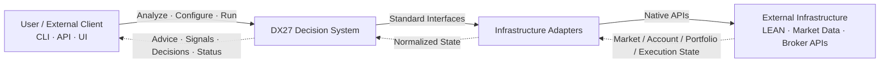

DX27 itself must not depend directly on a specific broker, market-data provider,
or trading engine.

External systems are accessed through adapters.


# 2. High-Level Architecture

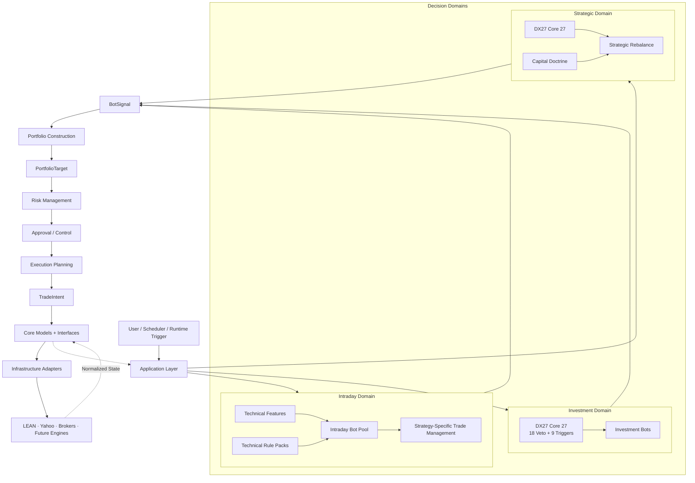

The Application Layer orchestrates complete workflows.

Runners must not directly coordinate strategy logic, account state, portfolio
construction, risk decisions, or execution.


# 3. Decision Domains

DX27 separates decision logic into three domains because their time horizons,
data requirements, and decision rules are fundamentally different.


## 3.1 Intraday Domain

The Intraday Domain is designed for fast technical trading.

It does not use the DX27 Core 27 investment framework by default.

Typical inputs include:

- price
- OHLCV
- volume
- volatility
- momentum
- trend
- VWAP
- market structure
- time-of-day information

Typical strategies may include:

- breakout
- momentum
- VWAP reclaim
- mean reversion
- opening-range strategies

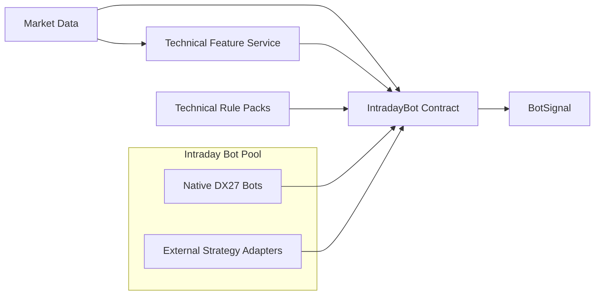

Intraday strategies must remain replaceable and testable independently.

A strategy should not need to know:

- which broker is connected
- whether it is running in backtest, paper, or live mode
- how account state is retrieved
- how orders are transmitted


## 3.2 Investment Domain

The Investment Domain handles medium- and long-term trading analysis.

Its main decision framework is the DX27 Core 27:

- 18 veto / risk rules
- 9 positive entry triggers

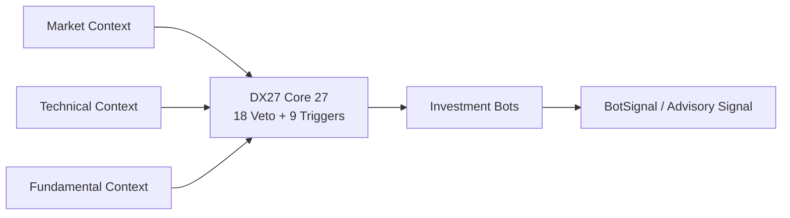

The Core 27 is primarily an investment decision framework.

It is not required for every intraday trade.


## 3.3 Strategic Domain

The Strategic Domain handles major portfolio-level decisions such as:

- annual rebalance
- major capital reallocation
- sector exposure changes
- long-cycle portfolio restructuring

It combines:

- DX27 Core 27
- Capital Doctrine
- portfolio state
- macro context
- sector context

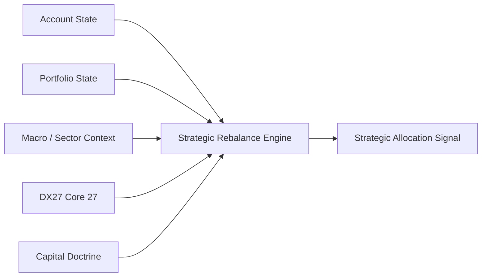

Capital Doctrine is a long-term allocation philosophy.

It is different from runtime Portfolio Construction.


# 4. Application Layer

The Application Layer coordinates complete use cases.

Examples:

```text
Intraday Trading
Investment Analysis
Strategic Rebalance
Historical Backtest
Paper Trading
Live Trading
```

The Application Layer is responsible for orchestration, not trading logic.

Conceptually:

```text
Runner
   ↓
Application
   ↓
Domain
   ↓
BotSignal
   ↓
Portfolio Construction
   ↓
PortfolioTarget
   ↓
Risk
   ↓
Approval
   ↓
Execution Planning
   ↓
TradeIntent
   ↓
Execution
```

Possible future structure:

```text
application/
├── intraday.py
├── analyze.py
├── rebalance.py
├── backtest.py
└── paper.py
```


# 5. Shared State

Market information alone is not enough.

DX27 must also understand the current account and portfolio state.

The shared state consists of normalized snapshots of external reality.

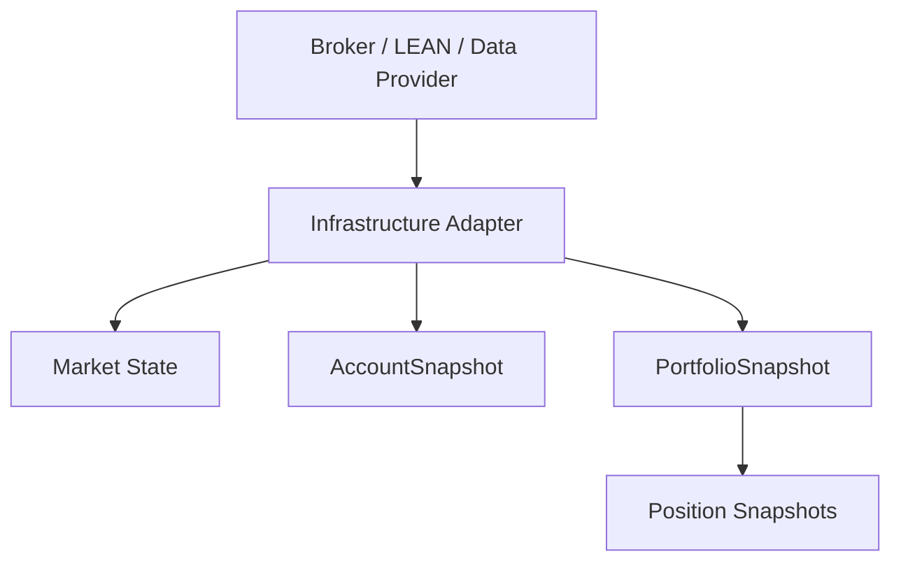

External infrastructure remains the authoritative source of account and
portfolio state.

DX27 operates on normalized representations of that state.


# 6. Account Model

`AccountSnapshot` describes the whole trading account.

Typical information includes:

```text
total equity
cash
buying power
margin state
currency
```

Example:

```text
Total Equity     €10,000
Cash              €4,000
Buying Power      €8,000
```


# 7. Portfolio Model

`PortfolioSnapshot` describes current holdings.

Example:

```text
AMD      €1,500
AMZN     €1,000
SOXL       €500
Cash     €4,000
```

Each position is represented by a normalized `Position` model.

Typical position state includes:

```text
symbol
quantity
average price
market price
market value
```


# 8. Portfolio Construction

Portfolio Construction converts strategy opinions into desired portfolio
positions.

It is responsible for combining:

- BotSignal
- current account state
- current portfolio state
- strategy capital budgets
- strategy weights
- existing positions
- multiple strategy signals
- allocation limits

It does not execute orders.

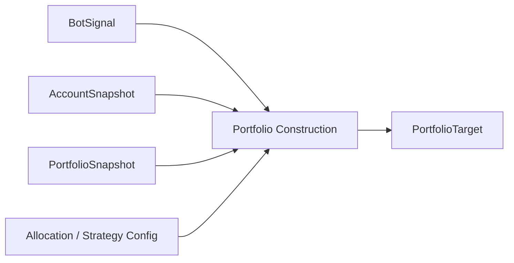

Example:

```text
Total Equity = €10,000

Intraday allocation = 15%
→ Maximum intraday budget = €1,500

Current intraday usage = €900
→ Remaining budget = €600
```

A strategy may produce a strong signal, but Portfolio Construction determines
how much capital may actually be allocated.

Portfolio Construction answers:

> What should the target portfolio position be?


# 9. PortfolioTarget

`PortfolioTarget` represents the desired resulting position.

It is not yet an order.

Example:

```text
Symbol: AMD
Target Notional: €700
Source Strategy: intraday_momentum_v2
```

If the current AMD position is already worth €200, the target does not mean:

```text
BUY €700
```

It means:

```text
Desired AMD position = €700
```

Execution Planning may later calculate:

```text
Current AMD = €200
Target AMD = €700

Required action:
BUY €500
```


# 10. Risk Layer

Risk is separate from Portfolio Construction.

Portfolio Construction answers:

> What position does the strategy want?

Risk answers:

> Is that target position acceptable for the account?

Risk policies may eventually include:

```text
maximum total exposure
daily loss limits
maximum leverage
portfolio concentration
correlation limits
maximum strategy drawdown
restricted symbols
order-size limits
account-level kill switch
```

Conceptually:

```text
PortfolioTarget
      ↓
Risk Policy
      ↓
Approved / Modified / Rejected PortfolioTarget
```

Risk is account-level protection.

Strategy-specific exits belong to the strategy domain.


# 11. Strategy-Specific Trade Management

Some trading rules are part of the strategy itself and should not be moved into
global account Risk.

Examples include:

```text
ATR trailing stop
VWAP exit
time-based exit
breakout invalidation
strategy-specific profit taking
```

These belong in:

```text
domains/intraday/trade_management/
```

Global Risk instead handles account-wide constraints such as:

```text
daily account loss
maximum leverage
maximum exposure
portfolio concentration
strategy allocation limits
```


# 12. Approval Layer

Approval is a separate control boundary.

It can support different operating modes.

Examples:

```text
fully automatic
manual confirmation
paper-only
restricted strategy
restricted symbol
emergency disable
```

Conceptually:

```text
Risk-Approved PortfolioTarget
        ↓
Approval
        ↓
Approved PortfolioTarget
```

Approval should not contain strategy logic.


# 13. Signal and Execution Separation

A strategy opinion is not an order.

DX27 separates four major stages.


## BotSignal

Represents strategy opinion.

Example:

```text
AMD
Direction: LONG
Confidence: 0.82
Reason: momentum breakout
```


## PortfolioTarget

Represents the desired resulting position.

Example:

```text
AMD
Target Notional: €700
Source Strategy: intraday_momentum_v2
```


## TradeIntent

Represents the concrete trading action needed to move from current portfolio
state toward the approved target.

Example:

```text
BUY AMD
Notional: €500
Strategy: intraday_momentum_v2
```


## ExecutionReport

Represents what actually happened at the broker or execution engine.

Example:

```text
Requested: 3 shares
Filled: 3 shares
Average Fill: $168.42
Status: Filled
```

The complete separation is:

```mermaid
flowchart LR

    Bot["Strategy Bot"]

    Signal["BotSignal"]

    Construction["Portfolio Construction"]

    Target["PortfolioTarget"]

    Risk["Risk"]

    Approval["Approval"]

    Planning["Execution Planning"]

    Intent["TradeIntent"]

    Execution["Execution Port"]

    Report["ExecutionReport"]

    Bot --> Signal

    Signal --> Construction
    Construction --> Target

    Target --> Risk
    Risk --> Approval

    Approval --> Planning
    Planning --> Intent

    Intent --> Execution
    Execution --> Report
```


# 14. Execution Planning

Execution Planning converts an approved `PortfolioTarget` into one or more
concrete `TradeIntent` objects.

Example:

```text
Current AMD position = €200
Approved target = €700
```

Execution Planning determines:

```text
Required delta = +€500
```

and produces:

```text
TradeIntent:
BUY AMD €500
```

Execution Planning may eventually consider:

- current position
- target position
- minimum order size
- fractional shares
- order type
- execution timing
- available liquidity
- broker capabilities

It does not determine whether the strategy is correct.


# 15. Runtime Data Flow

The complete runtime loop includes both market state and account state.

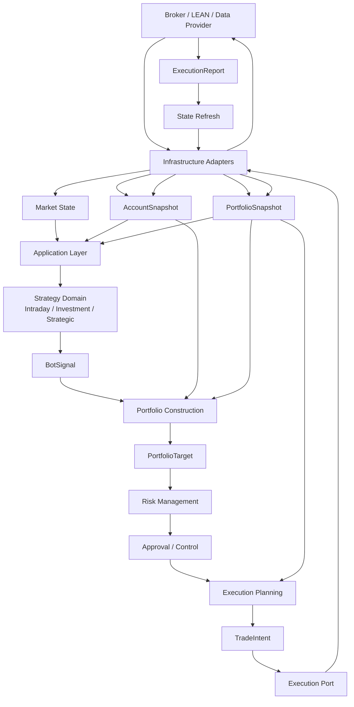

The broker or runtime remains the authoritative source of account state.

DX27 must not manually assume that a submitted order changed cash or positions.

After execution:

```text
TradeIntent
↓
Broker / Engine
↓
Fill
↓
ExecutionReport
↓
Refresh Account + Portfolio
↓
New Snapshots
↓
Application continues with refreshed state
```


# 16. Intraday Bot Contract

An intraday strategy must be isolated from infrastructure.

Native DX27 strategies and externally sourced strategies should eventually
follow the same logical contract.

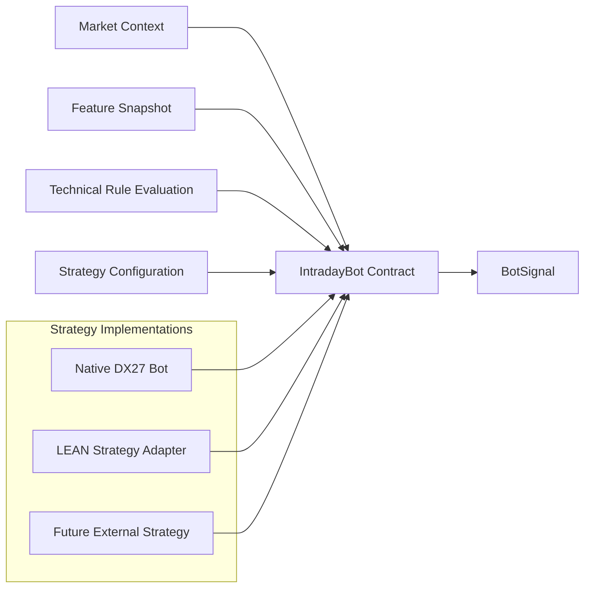

The strategy should not need to know:

```text
which broker is connected
whether execution is backtest/paper/live
how account state is retrieved
how orders are transmitted
how account balances are refreshed
```


# 17. Rule Architecture

Rules are reusable decision components.

Bots should not contain duplicated implementations of common rules.

The intended architecture is:

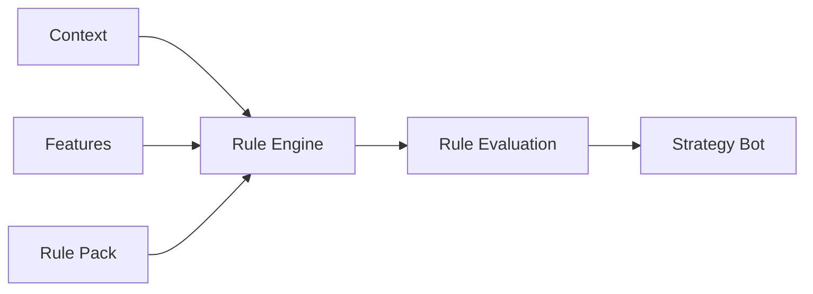

Different domains use different rule packs.


## Intraday

Uses technical rule packs.

Examples:

```text
momentum
volume
trend
volatility
VWAP
breakout
market structure
```


## Investment

Uses:

```text
DX27 Core 27
```

Containing:

```text
18 veto / risk rules
9 positive triggers
```


## Strategic

Uses:

```text
DX27 Core 27
+
Capital Doctrine
```


# 18. Strategy Bot Pool

DX27 should support multiple strategy implementations.

```text
Intraday Bot Pool
├── Native DX27 Bots
│   ├── Momentum V1
│   ├── Momentum V2
│   ├── Breakout V1
│   └── VWAP V1
│
└── External Strategy Adapters
    ├── LEAN Momentum
    ├── LEAN EMA Strategy
    └── Future Strategies
```

An external strategy may be used as a baseline.

DX27-specific technical rules can then be added iteratively and compared
against that baseline.


# 19. LEAN Integration

LEAN can play two different roles and these must remain separate.


## 19.1 LEAN as Runtime Infrastructure

DX27 strategy logic remains native.

LEAN may provide:

```text
market data
backtesting
account state
portfolio state
paper trading
execution
```

Conceptually:

```text
DX27 Strategy
      ↓
DX27 Contracts
      ↓
LEAN Runtime Adapter
      ↓
LEAN
```


## 19.2 LEAN as Strategy Source

Existing LEAN strategies may also be wrapped as DX27-compatible bots.

```text
LEAN Strategy
      ↓
LEAN Strategy Adapter
      ↓
IntradayBot Contract
      ↓
BotSignal
```

Suggested future structure:

```text
adapters/lean/
├── runtime/
│   ├── market_data.py
│   ├── account.py
│   ├── portfolio.py
│   └── execution.py
│
├── strategies/
│   ├── momentum.py
│   └── ema_cross.py
│
└── bridge/
```


# 20. Adapter Principle

DX27 Core must never import LEAN, Yahoo Finance, broker SDKs, or other external
infrastructure.

Dependencies point inward.

Correct:

```text
LEAN
  ↓
LEAN Adapter
  ↓
DX27 Interfaces
```

Incorrect:

```text
DX27 Core
  ↓
LEAN
```

This allows infrastructure to be replaced without rewriting strategy logic.


# 21. Core Ports

The planned core interfaces are:

```text
core/interfaces/
├── market_data.py
├── account.py
├── portfolio.py
├── execution.py
├── intraday_bot.py
├── portfolio_constructor.py
└── strategy.py
```


## MarketDataPort

Provides normalized market information.


## AccountPort

Provides normalized account-level state.


## PortfolioPort

Provides current holdings and position state.


## ExecutionPort

Accepts concrete trade intents and communicates with external execution
infrastructure.


## PortfolioConstructor

Converts one or more strategy signals into desired portfolio targets.


## IntradayBot

Defines the standard contract for short-term strategy bots.


## Strategy

Provides a generic strategy abstraction where useful.


# 22. Core Models

The shared model layer contains the common language used across domains and
infrastructure.

```text
core/models/
├── market_context.py
├── account_snapshot.py
├── portfolio_snapshot.py
├── portfolio_target.py
├── position.py
├── bot_signal.py
├── trade_intent.py
├── execution_report.py
├── rule_result.py
├── feature_snapshot.py
└── trade_result.py
```

Possible future additions include:

```text
strategy_metadata.py
order_state.py
allocation_state.py
```


# 23. Backtest / Paper / Live Principle

Strategy logic must remain identical across execution environments.

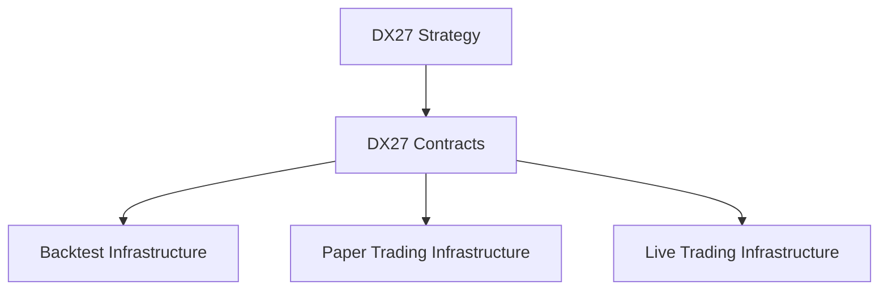

Only infrastructure implementations change.


## Backtest

```text
Historical Market Data
+
Simulated Account
+
Simulated Portfolio
+
Simulated Execution
```


## Paper Trading

```text
Live Market Data
+
Paper Account
+
Paper Portfolio
+
Paper Execution
```


## Live Trading

```text
Live Market Data
+
Live Account
+
Live Portfolio
+
Live Execution
```


# 24. State Ownership Principle

Strategy bots do not own account state.

Bots may hold strategy-specific state, but account truth belongs to external
infrastructure.

Responsibilities:

```text
Bot
    market interpretation

Application
    orchestrate the complete workflow

Portfolio Construction
    combine signals, account state, portfolio state, and allocation rules

Risk
    enforce account-level constraints

Approval
    control whether an approved target may proceed

Execution Planning
    convert target positions into concrete trade actions

Execution
    communicate orders

Broker / LEAN
    authoritative execution and account state
```


# 25. Runner Principle

Runners are composition roots.

They assemble the application and select adapters.

They must not contain:

- technical indicators
- strategy rules
- stop-loss logic
- take-profit logic
- portfolio calculations
- account calculations
- PnL calculations
- broker-specific business logic

A runner should eventually be approximately:

```python
app = create_application(
    environment="backtest",
)

app.run()
```

Changing from backtest to paper trading should primarily change configuration
and adapters, not strategy code.


# 26. Target Package Structure

The intended architecture is:

```text
src/dx27/
├── application/
│
├── core/
│   ├── interfaces/
│   └── models/
│
├── domains/
│   ├── intraday/
│   │   ├── bots/
│   │   ├── features/
│   │   ├── rules/
│   │   └── trade_management/
│   │
│   ├── investment/
│   │   ├── bots/
│   │   └── rules/
│   │       └── dx27_core_27/
│   │
│   └── strategic/
│       ├── doctrine/
│       └── rebalance/
│
├── portfolio_construction/
│
├── coverage/
│
├── risk/
│
├── approval/
│
└── adapters/
    ├── yahoo/
    └── lean/
        ├── runtime/
        ├── strategies/
        └── bridge/
```


# 27. Architectural Boundaries

The following boundaries are fundamental.


## Domain Independence

Intraday trading does not automatically depend on:

```text
fundamental analysis
DX27 Core 27
Capital Doctrine
```

Investment decisions use:

```text
technical context
fundamental context
DX27 Core 27
```

Strategic decisions use:

```text
portfolio context
macro / sector context
DX27 Core 27
Capital Doctrine
```


## Strategy Independence

A strategy must not depend directly on:

```text
LEAN
Yahoo
broker APIs
paper/live environment
```


## Portfolio Construction Independence

A strategy may express an opinion.

It does not directly control the final account allocation.


## Risk Independence

Strategy-specific trade logic and account-level risk must remain separate.


## Execution Independence

A `PortfolioTarget` is not an order.

A `TradeIntent` is a request for execution.

An `ExecutionReport` is the external execution result.


## State Authority

Broker / execution infrastructure is the authoritative account-state source.

DX27 operates on normalized snapshots and refreshes them after external state
changes.


# 28. Main Runtime Chain

The standard DX27 runtime chain is:

```text
Market / Account / Portfolio State
                │
                ▼
          Application Layer
                │
                ▼
          Strategy Domain
                │
                ▼
             BotSignal
                │
                ▼
      Portfolio Construction
                │
                ▼
          PortfolioTarget
                │
                ▼
               Risk
                │
                ▼
            Approval
                │
                ▼
       Execution Planning
                │
                ▼
           TradeIntent
                │
                ▼
        Execution Adapter
                │
                ▼
          Broker / LEAN
                │
                ▼
        ExecutionReport
                │
                ▼
      Account / Portfolio Refresh
```

This is the primary architectural flow of DX27.


# 29. Architectural Goal

DX27 should ultimately allow the same strategy logic to operate across
different execution environments.

```text
                     Same DX27 Strategy
                            │
                            ▼
                        BotSignal
                            │
                            ▼
                 Portfolio Construction
                            │
                            ▼
                    PortfolioTarget
                            │
                            ▼
                           Risk
                            │
                            ▼
                        Approval
                            │
                            ▼
                  Execution Planning
                            │
                            ▼
                      TradeIntent
                            │
             ┌──────────────┼──────────────┐
             ▼              ▼              ▼
         Backtest          Paper           Live
             │              │              │
             └──────────────┼──────────────┘
                            ▼
                    ExecutionReport
                            │
                            ▼
              Account / Portfolio Refresh
```

This separation allows DX27 to evolve trading logic without repeatedly
rewriting infrastructure, execution, account handling, or testing systems.