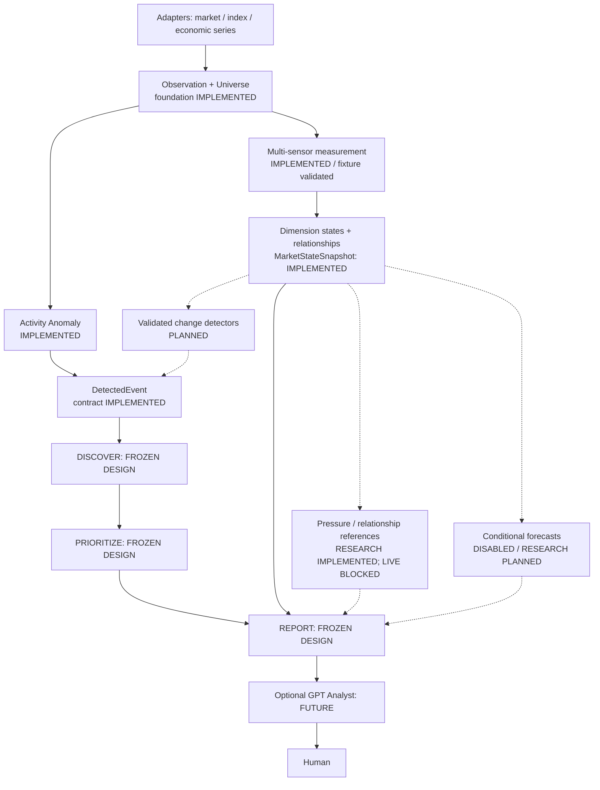
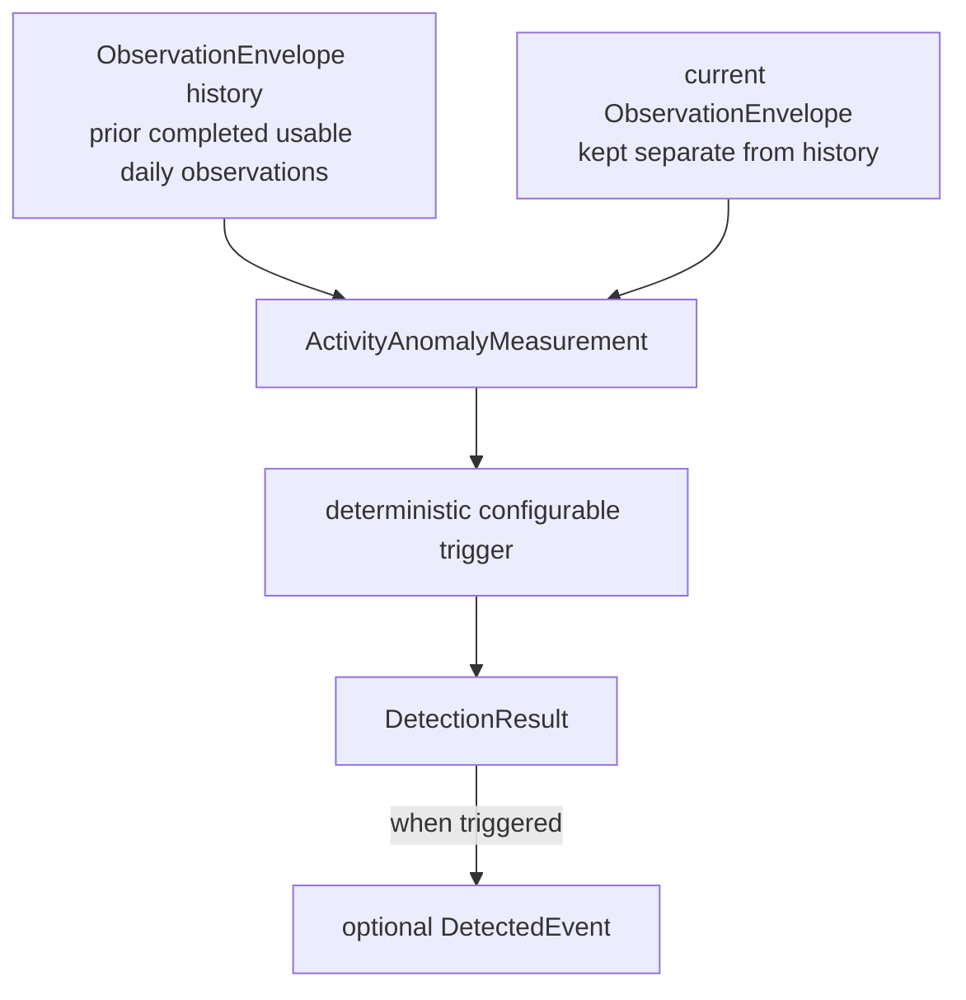

# DX27 System Overview

## 1. What DX27 is now

DX27 is currently being developed **Sentinel-first**: a deterministic, read-only
market observation system that turns completed market data into explicit,
replayable evidence for a human. Sentinel describes material changes; it does
not produce trading signals or control a portfolio.

The status labels in this document are deliberate:

- **IMPLEMENTED** — working contracts or behavior exist in the repository and
  are covered by tests.
- **FROZEN DESIGN** — semantics have been agreed, but the component is not yet
  implemented.
- **RESEARCH COMPLETE** — frozen evaluation artifacts exist; completion is not
  production approval.
- **AGREED DESIGN DIRECTION** — architectural revision awaiting contract and
  validation-protocol freeze.
- **NEXT** — the immediate contract/research or implementation work.
- **DEFERRED** — intentionally outside the current implementation path.

Infrastructure providers remain behind adapters. `MarketContext` is the
existing normalized OHLCV boundary used by Sentinel; provider or broker objects
must not enter Sentinel domain contracts. The implemented 6B-2H scalar bridge
uses typed SeriesPoint and validated source-binding metadata, not fabricated
OHLCV records for economic series.

## 2. Active architecture

The implemented foundation includes observations, deterministic event contracts,
the minimal daily Activity Anomaly detector, and 6B-2H multi-dimensional state
measurement. This measurement is fixture-validated; real source coverage is not
approved. New change detectors remain future work.



Dashed arrows represent unimplemented design. SPY is one capitalization-weighted
index sensor, not the market itself. Current state, observed change, reference
values, and conditional predictions have separate semantics and validation.
The [multi-sensor design revision](sentinel-multi-sensor-design.md) defines the
boundaries and 6B-2G–6B-2K sequence. The first contracts and reference candidates are frozen by
[6B-2G](sentinel-sensor-contracts-v1.md). State runtime conformance is implemented
in [6B-2H](sentinel-market-state-runtime.md); live-source and empirical gates remain open. GPT remains downstream of deterministic evidence.

## 3. Implemented foundation

### 3.1 Common foundation — 6A-1 (**IMPLEMENTED**)

The common layer supplies `DataStatus`, `SubjectRef`, `ObservationWindow`, and
`Provenance`, together with deterministic canonical serialization, hashing, and
stable identity utilities. Its purpose is stable cross-module identity and
explicit data-availability semantics. Missing data is represented explicitly;
it is never normal data and never zero.

### 3.2 Event foundation — 6A-2 (**IMPLEMENTED**)

The event contracts are `DetectedEvent`, `EventType`, `EventDirection`,
`EventMagnitude`, `EventBaseline`, `BaselineParameter`, `EventEvidence`,
`EvidenceLineage`, `UniverseContext`, `RelevanceContext`, and `SemanticFlag`.
Event identity and deduplication semantics are deterministic.

Correctness hardening requires every evidence subject to belong to its
referenced lineage. Evidence and provenance use a deterministic total canonical
ordering, and event identity does not depend on caller input ordering.
`DetectedEvent` records an observed fact; it is not a trading signal,
recommendation, priority, or execution request.

The frozen primitive taxonomy contains exactly nine categories:

1. `PRICE_LEVEL_INTERACTION`
2. `PRICE_GAP`
3. `TREND_CHANGE`
4. `ACTIVITY_ANOMALY`
5. `VOLATILITY_CHANGE`
6. `RELATIVE_STRENGTH_CHANGE`
7. `PARTICIPATION_CHANGE`
8. `RELATIONSHIP_CHANGE`
9. `SERIES_STATE_CHANGE`

The enum and event contracts support this vocabulary, but that does not mean
all nine detectors are implemented. Only `ACTIVITY_ANOMALY` currently has a
minimal daily detector. Primitive events describe observations, never buy/sell
recommendations.

### 3.3 Observation and universe foundation — 6A-3 (**IMPLEMENTED**)

Implemented universe contracts are `UniverseTier`, `UniverseMembership`,
`ContextualActivation`, `DiscoveryRejectionReason`, `DiscoveryEligibility`, and
`KnownInterestSnapshot`. The tiers are `CORE`, `CONTEXTUAL`, `DISCOVERY`, and
`EXCLUDED_NOISE`. Membership identity follows canonical `subject_id`, not
mutable ticker metadata. A contextual activation has a default TTL of 30
calendar days, measured from its latest material confirmation.

`KnownInterestSnapshot` is descriptive account/watchlist context only. It is
not a discovery filter.

Implemented observation contracts are `ObservationCoverage` and
`ObservationEnvelope`. The envelope reuses `MarketContext` rather than
duplicating OHLCV, binds an observation to universe membership and provenance,
and preserves explicit missing-data status.

### 3.4 Detection foundation — 6B-1 (**IMPLEMENTED**)

`DetectionResult`, `ActivityAnomalyConfig`, `ActivityAnomalyMeasurement`, and
`ActivityAnomalyDetector` establish the first detector framework. The current
detector is daily-only, operates on completed observations, detects elevated
activity only, is deterministic and no-lookahead, exposes configurable
thresholds, and has no trading semantics. Its emitted events and evidence have
stable identities. Insufficient history is an explicit result rather than an
ordinary non-event.

`DetectionResult` distinguishes these outcomes:

| Result | Meaning |
| --- | --- |
| `AVAILABLE` with `events=()` | Evaluation succeeded; no anomaly was detected. |
| `INSUFFICIENT_HISTORY` with `events=()` | Evaluation could not be performed reliably. |
| `SOURCE_ERROR` or `UNAVAILABLE` with `events=()` | An explicit data-availability problem prevented evaluation. |

Missing data must not be converted to zero or interpreted as normal activity.

### 3.5 Multi-dimensional state — 6B-2H (**IMPLEMENTED / FIXTURE VALIDATED**)

The scalar/OHLCV bridge, immutable source revisions, versioned XNYS schedule,
frozen sensor registry, sensor measurements, seven dimension states and
`MarketStateSnapshot` are implemented. `StateBuild` retains resolvable input and
lineage evidence. MarketNow v0.2 projection is implemented as a helper, without
implementing the full Report, Discovery or Priority engines.

State calculation preserves conflicting SPY/RSP evidence and proxy qualifiers,
and does not invent global regimes. True PIT internals stay unavailable. S/D
research is implemented with operational output disabled; new change detectors
and conditional forecasts remain disabled/unimplemented.
The live operational gate is BLOCKED_DATA: real provider binding/vintage and
>=95% operational coverage are not certified by synthetic conformance.

## 4. Current detection data flow



Keeping the current observation separate from baseline history reinforces the
no-lookahead boundary. The baseline uses only prior, completed, usable daily
observations. An `AVAILABLE` history item that overlaps or follows the current
period is rejected rather than silently allowing lookahead contamination.

Activity Anomaly v0.1 diagnostics include median historical volume, median
`log1p(volume)`, log-space median absolute deviation (MAD), relative volume,
empirical historical percentile, and optional robust z. Trigger thresholds are
explicit configuration. Current test and example values are framework fixtures,
not statistically proven, production-calibrated, or permanent thresholds. This
implementation establishes the detector framework first; it is not derived
from LEAN, and `RelativeDailyVolume` is not implemented.

## 5. Frozen architecture not yet implemented

### 5.1 Monitoring universe (**FROZEN DESIGN**)

The four-tier model remains `CORE`, `CONTEXTUAL`, `DISCOVERY`, and
`EXCLUDED_NOISE`. Design guidance—not current production population—is roughly
30–40 Core subjects, 25–75 Contextual subjects with a hard ceiling around 100,
and about 500 liquid US-listed daily Discovery candidates. No production
universe builder currently populates those sizes.

Daily data is the broad monitoring layer. Future 15-minute monitoring is
limited conceptually to Core, holdings, and explicitly activated Contextual
subjects.

### 5.2 Blind Spot Discovery (**FROZEN DESIGN**)

Blind Spot Discovery is not implemented. Its observation modes are
`GROUP_FIRST`, `GROUP_AND_MEMBERS`, and `MEMBER_EXCEPTION`, supporting unknown
outperformers, ETF volume/breadth shifts, cross-asset relationship breaks, and
macro contradictions.

Promotion has two paths: normal promotion from deterministic market evidence,
and fast promotion only when an approved structured catalyst source exists.
Contextual TTL is anchored to the latest material confirmation; unchanged
repetition does not reset it. Discovery never permanently expands the universe.
Future GPT narrative challenge may assist interpretation but is never
authoritative.

### 5.3 Priority Engine (**FROZEN DESIGN**)

Priority remains outside `DetectedEvent` and follows the frozen sequence:

```text
hard gates
    ↓
semantic dedup
    ↓
clustering
    ↓
bounded ordinal components
    ↓
deterministic predicates
    ↓
P0 / P1 / P2 / NOISE
    ↓
lexicographic rank
    ↓
top-K presentation
```

This is deliberately not a weighted aggregate score. The default presentation
target is about six items and is configurable to approximately five through
seven. P0 is never silently suppressed.

### 5.4 SentinelReport (**FROZEN DESIGN**)

`SentinelReport` as a complete engine is not implemented; 6B-2H supplies the
MarketNow v0.2 state-projection helper only. `Market Now` and `Portfolio Now` are peer
top-level concepts. Future report concepts include `Attention Queue`, `Since
Last Visit`, explicit missing-data disclosure, Account Equity, an Investment
Performance Index, SPY as the primary benchmark, and optional QQQ or custom
benchmarks. Reports keep **Sentinel Evidence** strictly separate from **Analyst
Interpretation**.

## 6. Research checkpoint and what comes next

6B-2A–6B-2F completed trend research and real-data validation, not production
Trend Change or Volatility Change detection. `ewmac_64_256` was selected under
the frozen Stage-A protocol with `STAGE_A_WEAK_PASS`; the frozen robustness run
returned `ROBUSTNESS_FAIL` because four ETFs fell below the full-period DC60
floor. It remains a research baseline, not an approved detector. The
[research archive](../../research/sentinel/6b-2e-6b-2f-ewmac/README.md) preserves
protocols, reports, audit tables, and hashes, with explicit raw-data retention
limits.

**6B-2G — Multi-Sensor Contracts & Validation Protocol** is complete as a
frozen design/protocol artifact, with an exact lock and offline validation.
It does not implement measurements or establish effectiveness.
**CURRENT** is **6B-2I — Composite Reference & Relationship Research**: causal
S/D research and the reference library are implemented; real source admission
and incremental effectiveness remain BLOCKED_DATA. See the
[research checkpoint](sentinel-composite-reference-research.md).
6B-2H state measurement/projection has passed implementation conformance; its
real-source operational gate remains BLOCKED_DATA. Subsequent gated tasks cover
reference incremental-value research (6B-2I), online change validation
(6B-2J), and separately validated conditional forecasts (6B-2K). Forecast output
is disabled by default. The parent 6B-2 remains open; later production integration
and Discovery, Priority and Report retain their existing roadmap numbering.

This design direction leaves the existing nine event primitives, non-weighted
ordinal Priority, read-only boundary, and implemented Activity Anomaly intact.
A composite reference cannot replace Priority or suppress independent events.
The explicit 6B-2G report v0.2 design adds optional state/reference/forecast
attachments while preserving v0.1 required containers and priority rules.

## 7. GPT Analyst boundary (**FUTURE**)

The GPT Analyst layer is not implemented. It may later provide causal
explanation, news synthesis, alternative hypotheses, contradiction analysis,
falsification/challenge, and concise briefings. It is never authoritative for
deterministic market measurements, event detection, risk limits, priority hard
gates, or execution. Deterministic Sentinel output remains useful when Analyst
enrichment is unavailable.

## 8. Execution boundary (**DEFERRED**)

Sentinel is read-only. Broker execution, position sizing, capital allocation,
order routing, automated portfolio changes, and live autonomous trading are
intentionally deferred and are not active Sentinel implementation.

## 9. Existing / legacy capabilities

The repository retains useful earlier prototypes and tested capabilities,
including historical replay, simulated account/execution components, the ORB
intraday bot, and Yahoo/LEAN adapter experiments. They remain historical or
existing capabilities and useful research infrastructure, but bot-first,
coordinator-first, capital-allocation-first, execution-first, and LEAN-centered
plans are not the current development frontier. Earlier Phase 1A/1B sequencing
is likewise legacy context rather than the active roadmap.
