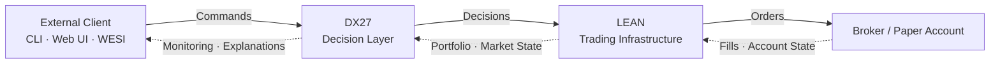
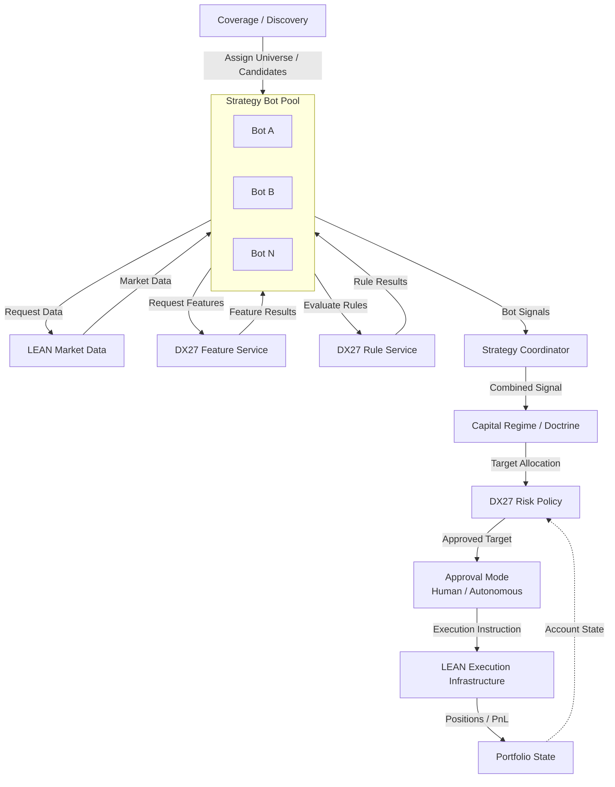
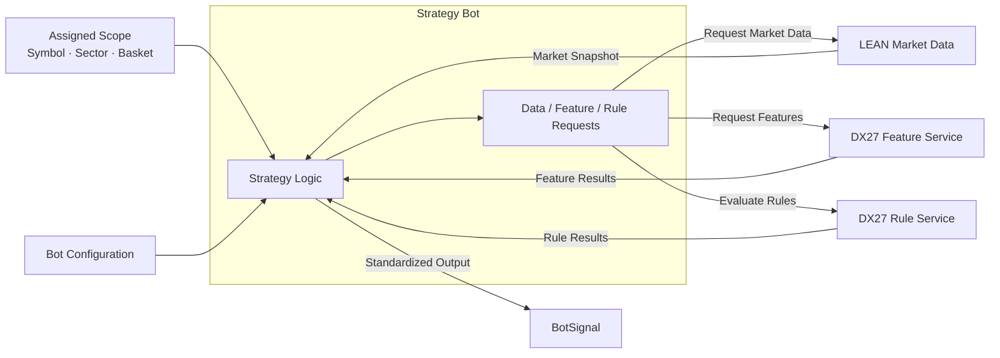

# DX27 Trading Engine — System Overview

## System Context

```mermaid
flowchart LR

    Client["External Client<br/>CLI · Web UI · WESI"]

    DX27["DX27<br/>Decision Layer"]

    LEAN["LEAN<br/>Trading Infrastructure"]

    Broker["Broker / Paper Account"]

    Client -->|Commands| DX27
    DX27 -->|Decisions| LEAN
    LEAN -->|Orders| Broker

    Broker -.->|Fills · Account State| LEAN
    LEAN -.->|Portfolio · Market State| DX27
    DX27 -.->|Monitoring · Explanations| Client
```

## Internal Architecture

```mermaid
flowchart TB

    Coverage["Coverage / Discovery"]

    subgraph Strategies["Strategy Bot Pool"]
        direction LR
        B1["Bot A"]
        B2["Bot B"]
        BN["Bot N"]
    end

    Data["LEAN Market Data"]
    Features["DX27 Feature Service"]
    Rules["DX27 Rule Service"]

    Coordinator["Strategy Coordinator"]
    Doctrine["Capital Regime / Doctrine"]
    Risk["DX27 Risk Policy"]
    Approval["Approval Mode<br/>Human / Autonomous"]

    LEAN["LEAN Execution Infrastructure"]
    Portfolio["Portfolio State"]

    Coverage -->|Assign Universe / Candidates| Strategies

    Strategies -->|Request Data| Data
    Data -->|Market Data| Strategies

    Strategies -->|Request Features| Features
    Features -->|Feature Results| Strategies

    Strategies -->|Evaluate Rules| Rules
    Rules -->|Rule Results| Strategies

    Strategies -->|Bot Signals| Coordinator
    Coordinator -->|Combined Signal| Doctrine
    Doctrine -->|Target Allocation| Risk
    Portfolio -.->|Account State| Risk

    Risk -->|Approved Target| Approval
    Approval -->|Execution Instruction| LEAN

    LEAN -->|Positions / PnL| Portfolio
```

## Bot Contract

```mermaid
flowchart LR

    Scope["Assigned Scope<br/>Symbol · Sector · Basket"]
    Config["Bot Configuration"]

    subgraph Bot["Strategy Bot"]
        Logic["Strategy Logic"]
        Request["Data / Feature / Rule Requests"]
    end

    Data["LEAN Market Data"]
    Features["DX27 Feature Service"]
    Rules["DX27 Rule Service"]

    Signal["BotSignal"]

    Scope --> Logic
    Config --> Logic

    Logic --> Request

    Request -->|Request Market Data| Data
    Data -->|Market Snapshot| Logic

    Request -->|Request Features| Features
    Features -->|Feature Results| Logic

    Request -->|Evaluate Rules| Rules
    Rules -->|Rule Results| Logic

    Logic -->|Standardized Output| Signal
```